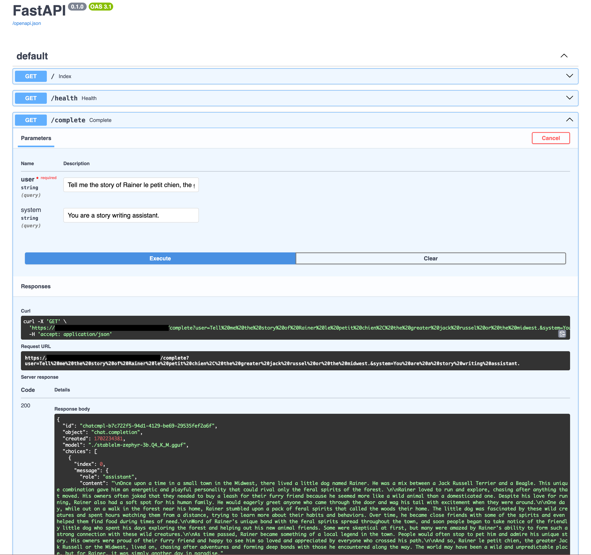

# Stablelm-Zephyr-Serverless

## Overview
This project is a chatbot service built using FastAPI, powered by the llama-cpp library. It uses a pre-trained model from **Hugging Face** `TheBloke/stablelm-zephyr-3b-GGUF` to generate chat completions based on user input. 

The service is designed to be deployed on Google Cloud Run, offering a scalable and serverless platform for handling requests, and runs fully on CPU thanks to the efficient inference of [llama-cpp](https://github.com/ggerganov/llama.cpp).

The LLM Running is StableLM Zephyr 3B, which is a 3 billion parameters models released by [Stability.ai](https://stability.ai/news/stablelm-zephyr-3b-stability-llm).

**NB:** This model is released under a non-commercial license, and is not suitable for commercial use. You can contact Stability.ai for commercial licensing [here](https://stability.ai/contact).

## Local Setup
To run the service locally, ensure you have Docker installed. Build the Docker image using the provided Dockerfile and run it, because I use openblas for CPU inference, you might need to run it with the x86_64 architecture if you are on a apple silicon machine.
```bash
docker build -t chatbot-service .

docker run -p 8000:8000 chatbot-service
Access the service at http://localhost:8000.
```

## Google Cloud Platform (GCP) Configuration

1. Create a GCP project
2. Enable billing for the project
3. Enable the following APIs for the your GCP project:
    - **Cloud Build**
    - **Cloud Secret API**
    - **Artifact Registry**
    - **Cloud Run APIs**:

4. Grant the Cloud Build service account the following roles:
    - **Artifact Registry Admin**
    - **Cloud Run Admin**
    - **Secret Manager Admin**

5. Create a repository in Artifact Registry to store the Docker image.

6. Create a Cloud Build Trigger:
Create a Cloud Build trigger that will build and deploy the service on every push to the main branch of the repository (you will need to conenct your GitHub account to GCP). The trigger should use the cloudbuild.yaml file in the repository.

Here is the configuration for the trigger I have used and that seems to work well:

- **_CONCURRENCY_**: 1
- **_CPU_**: 8
- **_MEMORY_**:  8G
- **_PROJECT**: [YOUR_PROJECT_ID]
- **_REGION**: [YOUR_REGION]
- **_REPO_NAME**: [YOUR_ARTIFACT_REGISTRY_REPO_NAME]
- **_SERVICE_NAME**: [YOUR_CLOUD_RUN_SERVICE_NAME]



## Benchmark

By running the following command, you can run a simple benchmark on the service. It will send requests to the service, and measure the average response time, and cold start time.

```
python benchmark.py --url [CLOUD_RUN_SERVICE_URL]
```

The results I got are the following:

- Warm-up (cold start) time: 8.44 seconds
- Total time for subsequent requests: 23.63 seconds
- Average request time: 7.88 seconds per request
- Average tokens per second: 11.78 tokens/sec

This is fast enough for some conversational applications, by activating the streaming model you could use it for some real time chat application.

It might not be appropriate when longer generation is generated, as the latency would be too high.

## Pricing

The price for a Cloud run machine in a Tier 1 datacenter is:

[GCP pricing](https://cloud.google.com/run/pricing)
- CPU: $0.00002400 / vCPU-second beyond free tier
- RAM: $0.00000250 / GiB-second beyond free tier

So for a 8 CPU, 8GB RAM machine, the cost is $0.000212 / second.

This means that the cost per 1000 tokens is $0.000212 / 11.78 * 1000 = $0.018

This is on par with the cost of the GPT-4 API, which is $0.06 per 1000 tokens.

But much more expensive than the GPT-3.5 Turbo API, which is $0.002 per 1000 tokens.
And the OpenAI Models are much more capable.

As a point of comparison, using [Together.ai](https://together.ai/), it would cost us $0.0001 per 1000 tokens, which is much cheaper than running our own service.

And this calculation did not account for the cold start time which would add to the cost of the requests.

## Privacy 

The main interest of running your own service is to have full control over the data that is sent to the model. This is especially important if you are working with sensitive data.

# Future work

- Add a streaming API to reduce the latency of the requests
- Further improve response time by integrating future work from [llama-cpp](https://github.com/ggerganov/llama.cpp)
- Deploy with models available for commercial use.